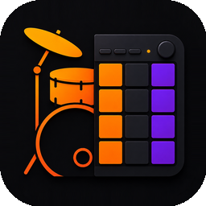

# Drum AI Sequence

  

Create editable Drum AI drum patterns from natural-language requests in ChatGPT.
The plugin uses the Drum AI PRESET MCP service to build, validate, and render a
pattern. Each completed request returns both a Drum AI app import link and a
web preview link.

  

## Get Drum AI

[Download Drum AI on the App Store](https://apps.apple.com/app/id6782609749).
Install the app to open the Drum AI import links generated by this plugin.

## Use it in ChatGPT

After enabling the plugin, describe the beat you want in plain English. For
example:

- `Create a four-bar funk groove at 102 BPM with ghost notes and a short fill.`
- `Make a half-time trap beat at 140 BPM.`
- `Turn this rhythm idea into a Drum AI sequence: kick on 1 and 3, snare on 2 and 4, with eighth-note hats.`

ChatGPT will generate a validated pattern and return:

1. A clickable **[Open in Drum AI](drumai://import?p=...)** link, which imports the pattern into the Drum AI app.
2. A clickable **[View web preview](https://c1c1.online/drumai_mcp/p?p=...)** link, which opens the rendered PRESET in a browser.

## Install as your own ChatGPT plugin

This package requires a ChatGPT account or workspace where personal plugins are
available. No local server is required: the package connects to the hosted Drum
AI PRESET MCP endpoint defined in `mcp.json`.

1. Download or clone this repository.
2. Keep the `drum-ai-sequence` directory intact, including hidden files such as
   `.codex-plugin/plugin.json`.
3. Create a ZIP archive whose top-level item is the `drum-ai-sequence` folder.
4. In your ChatGPT workspace's plugin management area, choose the option to add
   or upload a personal plugin, then select that ZIP archive.
5. Enable **Drum AI Sequence** and start a new chat with the plugin selected.

If your ChatGPT workspace does not show a personal-plugin upload option, ask
your workspace administrator to enable it or use the workspace's supported
plugin installation process.

## Requirements

- Access to ChatGPT personal plugins in your account or workspace.
- Network access to `https://c1c1.online/drumai_mcp/mcp`.
- The Drum AI app, if you want to open the generated import link directly.

## Package contents

- `plugin.json` — plugin metadata and ChatGPT presentation settings.
- `mcp.json` — connection to the hosted Drum AI PRESET MCP service.
- `skills/drumai-preset/SKILL.md` — instructions for generating and returning
  Drum AI patterns.
- `assets/drum-ai-icon.png` — plugin icon.
- `assets/download-on-the-app-store.svg` — official App Store download badge.
